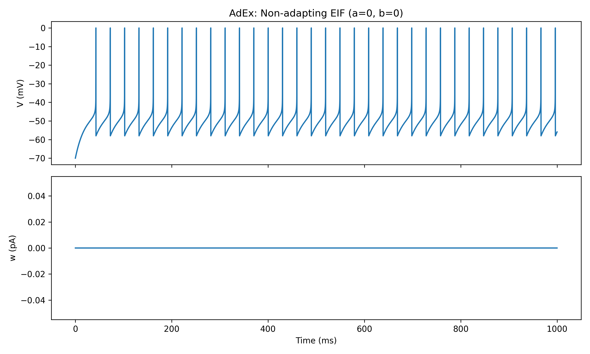
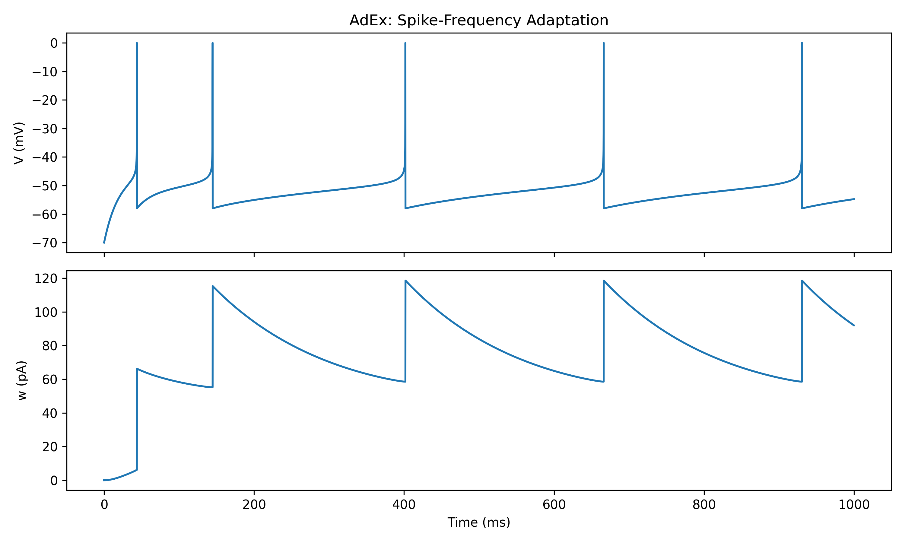
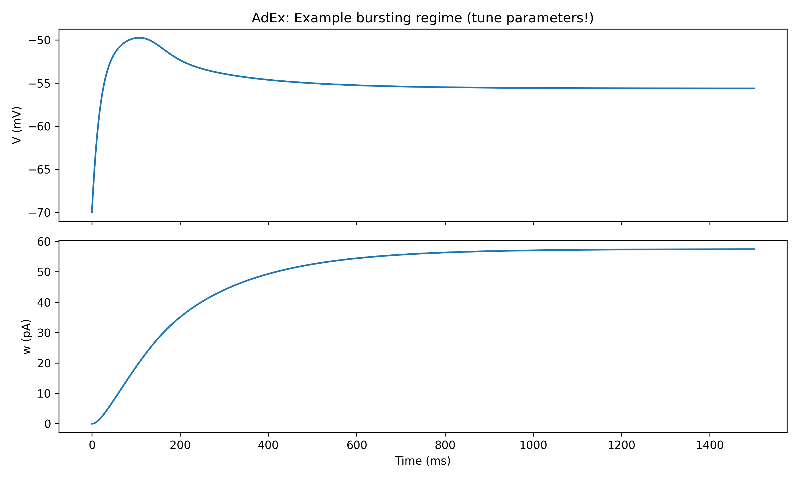
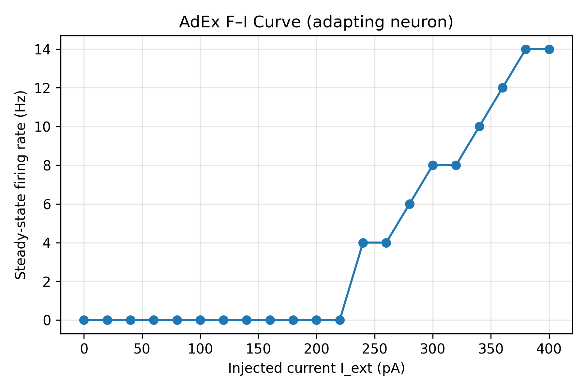

# 🧠 Adaptive Exponential Integrate-and-Fire (AdEx) Neuron Model

---

## 📌 Topic

**Adaptive Exponential Integrate-and-Fire (AdEx) Neuron Modeling, Simulation, and Analysis**

---

## 📝 200-Word Description

The Adaptive Exponential Integrate-and-Fire (AdEx) model is a powerful mathematical framework that bridges the gap between simple neuron models like Leaky Integrate-and-Fire (LIF) and biologically detailed models like Hodgkin–Huxley (HH). Unlike basic LIF neurons, which spike with a fixed threshold and lack realistic firing dynamics, AdEx incorporates both an exponential spike-onset mechanism and a slow adaptation current. This allows it to reproduce real neuronal behaviors such as tonic firing, spike-frequency adaptation, bursting, and threshold dynamics observed in cortical neurons.

In this project, we derive the AdEx equations from first principles, implement them numerically using Euler integration, and visualize key dynamical regimes through voltage traces, adaptation trajectories, and firing-rate analysis. We explore non-adapting, adapting, and bursting-like behaviors, demonstrating how simple parameter changes yield dramatically different firing patterns. Finally, we compute and plot the F–I curve (firing rate vs input current), a standard electrophysiological metric used to characterize neuronal excitability. By combining theory, simulation, and data visualization, this project provides a comprehensive understanding of how biophysically inspired mechanisms shape neural activity, making AdEx a valuable model for computational neuroscience, neural coding, and spiking neural network research.

---

# ------------------------------------------------------------
# ✅ 1. Introduction
# ------------------------------------------------------------

Biological neurons integrate electrical input, fire action potentials (spikes), and adapt dynamically over time. Traditional models either oversimplify this process (LIF) or become mathematically heavy (Hodgkin–Huxley). The AdEx model provides a middle ground — computationally efficient yet capable of reproducing realistic firing behaviors.

The model adds:

- **Exponential spike initiation** → mimics rapid sodium activation
- **Adaptation current** → mimics slow potassium-driven fatigue
- **Reset rule** → creates discrete spikes without solving full HH dynamics

---

# ------------------------------------------------------------
# ✅ 2. Model Explanation
# ------------------------------------------------------------

### 🔹 State Variables

- **Membrane potential**: \( V(t) \)
- **Adaptation current**: \( w(t) \)

### 🔹 Core Concepts

| Mechanism | Biological Meaning | Mathematical Effect |
|----------|--------------------|---------------------|
| Leak | Membrane decay | Pulls V toward rest |
| Exponential term | Sodium spike initiation | Drives spiking |
| Adaptation | Slow K\(^+\) current | Slows firing over time |
| Reset | Action potential event | Discrete spike output |

---

# ------------------------------------------------------------
# ✅ 3. Mathematical Model
# ------------------------------------------------------------

### 🔹 Membrane Voltage Equation

\[
C \frac{dV}{dt} =
- g_L (V - E_L)
+ g_L \Delta_T \exp\left(\frac{V - V_T}{\Delta_T}\right)
- w
+ I_{\text{ext}}(t)
\]

### 🔹 Adaptation Equation

\[
\tau_w \frac{dw}{dt} = a (V - E_L) - w
\]

### 🔹 Spike and Reset Rule

If \( V(t) \ge V_{\text{spike}} \):

\[
V \leftarrow V_{\text{reset}}, \quad
w \leftarrow w + b
\]

---

# ------------------------------------------------------------
# ✅ 4. Method & Implementation
# ------------------------------------------------------------

### 🔹 Numerical Method
- **Euler forward integration**
- Time step: `dt = 0.1 ms`
- Total duration: `T = 1000–2000 ms`

### 🔹 Files in the Project
```
simulate_adex.py      → Core simulator
visualize_adex.py     → Experiments + plots
plots/                → Saved output figures
README.md             → This documentation
```

### 🔹 Simulation Steps
1. Initialize `V` and `w`
2. For each timestep:
   - Compute `dV/dt` and `dw/dt`
   - Update `V` and `w`
   - Check for spike/reset
3. Record spike times
4. Plot membrane and adaptation traces

---

# ------------------------------------------------------------
# ✅ 5. Results & Analysis
# ------------------------------------------------------------

This section contains all generated plots and interpretations.

---

## 🔹 5.1 Non-Adapting EIF Regime

**Parameters:** `a = 0`, `b = 0`

**Plot:**  


**Interpretation:**
- Firing is regular and constant
- Adaptation remains flat
- Behavior mimics a standard exponential LIF neuron

---

## 🔹 5.2 Adapting Regular Spiker

**Parameters:** `a = 2`, `b = 60`

**Plot:**  


**Interpretation:**
- Spikes start fast, then slow down
- `w(t)` increases after each spike
- Demonstrates spike-frequency adaptation

---

## 🔹 5.3 Bursting-Like Regime (Exploratory)

**Plot:**  


**Interpretation:**
- Strong adaptation and current changes can induce bursting-like behavior
- Useful for modeling thalamic or hippocampal neurons

---

## 🔹 5.4 F–I Curve (Firing Rate vs Input Current)

**Plot:**  


**Interpretation:**
- Low input → no firing (subthreshold)
- Increasing input → increasing firing rate
- Adaptation causes sublinear growth and saturation

---

# ------------------------------------------------------------
# ✅ 6. Key Insights
# ------------------------------------------------------------

- The exponential term creates biologically realistic spike onset
- Adaptation controls firing-rate fatigue and bursting
- Small parameter changes produce diverse firing modes
- AdEx balances simplicity and realism better than LIF or HH

---

# ------------------------------------------------------------
# ✅ 7. Conclusions
# ------------------------------------------------------------

The AdEx neuron model successfully captures essential neuronal dynamics using only two differential equations and a reset rule. It reproduces realistic firing patterns such as tonic spiking, spike-frequency adaptation, and bursting, all while remaining computationally efficient. The F–I curve further reveals how adaptation shapes neuronal excitability, demonstrating the model’s value in neural coding, cortical dynamics, and spiking neural network research. Overall, AdEx provides a versatile and biologically grounded tool for exploring single-neuron behavior and building scalable neural simulations.

---

# ------------------------------------------------------------
# ✅ 8. Future Work
# ------------------------------------------------------------

- Phase-plane (V–w) stability analysis
- Network simulations with synaptic coupling
- Parameter fitting to biological recordings
- Comparison with Hodgkin–Huxley dynamics

---

# ✅ End of README ✅
